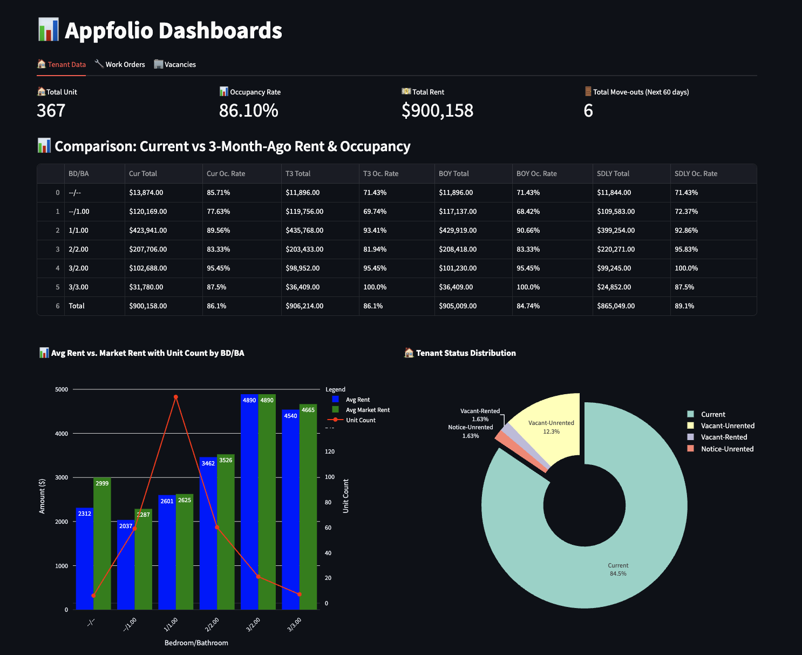
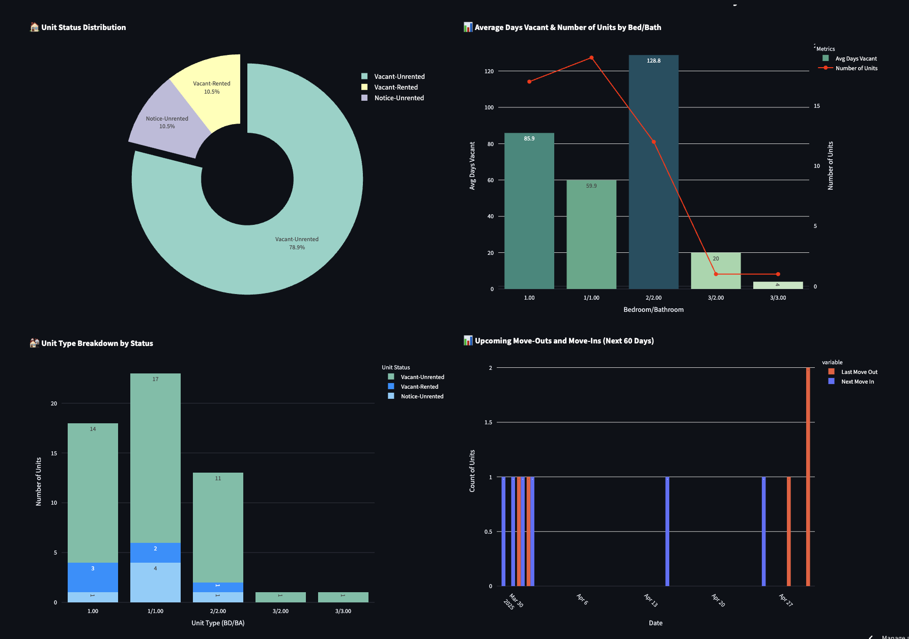

# 📊 AppFolio Business Dashboard

This is a Streamlit-based dashboard for analyzing property management data, including tenants, vacancies, rents, and work orders. It generates dynamic metrics, tables, and visualizations, and automatically loads the latest datasets from the `/data` folder.

---

##  Features

- 📁 **Automatic CSV Detection**: Finds and loads the latest file for each data category based on filename timestamps.
- 🏠 **Tenant Dashboard**:
  - Occupancy rate calculations
  - Rent vs. Market Rent analysis
  - BD/BA summaries with time-based comparisons
  - Late payment visualization
  - Tenant status distribution
- 🔧 **Work Orders Dashboard**:
  - Count of new and urgent work orders
  - Total amount analysis
  - Work order type breakdown
  - Top issues in work orders
- 🏢 **Vacancy Dashboard**:
  - Rent-ready and upcoming move-in units
  - Average days vacant by unit type
  - Unit status distribution and breakdown
  - Upcoming move-outs and move-ins (60 days)
- 🖼️ **Chart Exporting**: Saves all generated charts as high-resolution images using Plotly and Matplotlib.

---

## 🗂 Link: https://selengetu-appfolio-dashboard-streamlit-ibuwou.streamlit.app/

